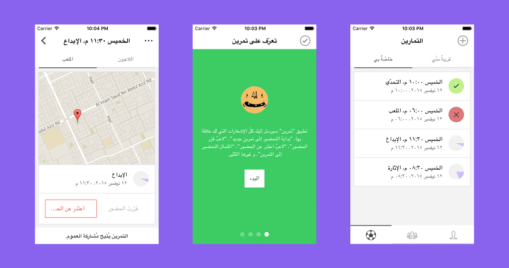

## How to install?
- Install node.js, npm, bower, gulp, cordova, ionic.
- In the application root directory (tamreen), run the command <code>npm install</code>.
- In the application root directory (tamreen), run the command <code>bower install</code>.
- In the directory <code>www/js</code>, duplicate the file <code>configs.template.js</code> and give the new file the name <code>configs.js</code>.
- Run <code>./init.sh</code>.
- Run <code>ionic emulate ios</code> for iOS.
- If you want to test it on Android, you must install Genymotion, and have inside it any Android device (e.g. Nexus 5), and then keep it running.
- Run <code>ionic run android</code> for Android.

## How to build a release?
- <code>cordova build --release</code>.
- <code>jarsigner -verbose -sigalg SHA1withRSA -digestalg SHA1 -keystore keys/TamreenApp.keystore platforms/android/build/outputs/apk/android-release-unsigned.apk TamreenApp</code>.
- <code>/Users/hossamzee/android-sdk-macosx/build-tools/21.1.2/zipalign -v 4 platforms/android/ant-build/CordovaApp-release-unsigned.apk TamreenApp1.0.1.apk</code>.

## Done:
- Check every pullToRefresh method to respond to the current view.
- Clean inputs everytime a form appears (No need for now).
- There seems to be an issue when choosing the current location of the user (pages/choosemap.html).
- Fix the issue of the scroll when adding a new training.
- Add the ability for the user to see the readAt value.
- Shorten the words when the interface is trainings.
- Remove a lot of the inner styles.
- Design the about page.
- Fix the error when there is no internet access.
- Make the services real, e.g. Contacts, Location, Storage, etc.
- Display the notifications and what is relevant.
- Make the map in training details clickable.
- Fix the android back button, the button should be in the left.
- No Content-Security-Policy meta tag found. Please add one when using the cordova-plugin-whitelist plugin.
- Footer is broken in many places.
- AndroidPersistentFileLocation.
- Error messages must be in Arabic.
- Make the TOS (Mention that the faces are randomly generated, they do not mean anything personal).

## TODO:
- Tell the user about the current state of the app, e.g. Loading..., etc.
- Check the deviceType value sometimes it happens to be null.
- Take some beautiful screenshots for the app to market it.
- There is an issue of performance when getting trainings that are around.
- Maybe fix the indian number validations.
- Fix the rounding with buttons bar.
- Check the warnings about SVG and fix them as possible.
- $rootScope concept is really ill (Fix the issue with the events).
- Fix the readme file or update it.
